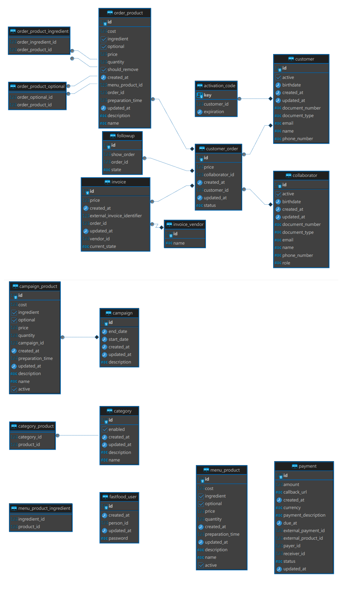

# fastfood-rds-configuration

Este repositório serve para configurar os bancos de dados relacionais do Fastfood API.

## Justificativa para escolha do Postgres

Escolhemos o Postgres pois é uma ferramenta open source,  sem custos, consistente, performatico, altamente escalável e excelente para grandes volumes de dados, tem uma modelagem hibrida que combinam dados relacionais e não relacionais (como o JSON), também implementa transações ACID que garantem a consistencia dos dados em casos de falha (importante para aplicações financeiras), possui grande comunidade ativa, e é um dos bancos de dados suportados pelo Amazon RDS.

## Diagrama Entidade-Relacionamento do Banco

